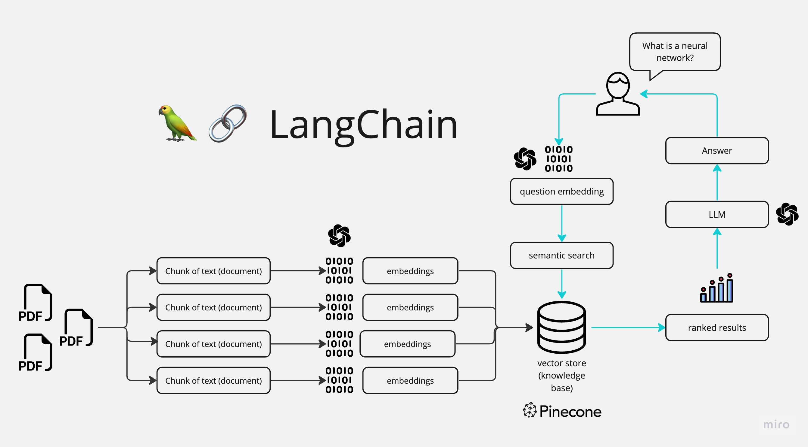

# Chat with Multiple PDFs

A Streamlit app that lets you upload several PDF files and ask questions about them in a chat interface. Answers are generated from the content of your documents.



## How it works

1. **Extract**: text is read from every uploaded PDF (PyPDF2).
2. **Chunk**: the text is split into 1000-character chunks with 200 characters of overlap (LangChain).
3. **Embed and index**: chunks are embedded with OpenAI embeddings and stored in a FAISS vector store.
4. **Answer**: a conversational retrieval chain finds the most relevant chunks and passes them to the chat model, with conversation memory so follow-up questions work.

Hugging Face models and Instructor embeddings are available as commented-out alternatives in `app.py`.

## Setup

```bash
pip install -r requirements.txt
cp .env.example .env     # add OPENAI_API_KEY (and HUGGINGFACEHUB_API_TOKEN if used)
streamlit run app.py
```

Upload your PDFs in the sidebar, click **Process**, then ask questions in the main panel.

## Stack

Python, Streamlit, LangChain, OpenAI, FAISS, PyPDF2

## Note

Dependencies are pinned to older versions (`langchain==0.0.184`, `openai==0.27.6`), which may not install on recent Python versions.
